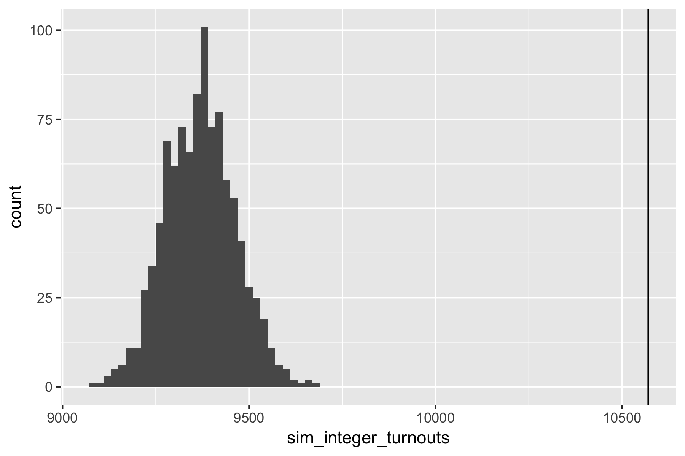

## ST441/541 Welcome!

Did you get the announcement from canvas?

> I've attached a short article (2 pages) about election fraud in Russia's recent election.  Before Thursday, please read it and be prepared to answer the following questions:
>    
>    * What feature of Figure 1 do the authors argue is evidence for election fraud?
>    
>    * For a particular year, say 2018, how do the authors measure the statistical significance of the feature in Figure 1?  What statistic do they calculate?  What do they compare that statistic to? 

Article is circulating if you want to read/review it now.

If you bought your laptop (great!), head to https://rstudio.cloud/ and sign up for an account.

---

## Introductions

My name is Charlotte! [wickhamc@oregonstate.edu](mailto:wickhamc@oregonstate.edu)

[stat541.cwick.co.nz](http://stat541.cwick.co.nz)

I'm excited about teaching this class because:

* I love R (and we aren't using Matlab!)
* We get to focus on computation rather that it being a side topic
* I get to learn more about your interests through your projects

---

## General Overview

My goal (from the syllabus):

> Prepare you to plan, organize, implement and communicate a computationally intensive statistical investigation.  

Learning objectives:

* Investigate properties of random variables through simulation.
* Break down a computational task into modular components and implement them in R.
* Balance the concerns of speed and clarity to write R code that is both efficient and understandable.
* Organize a computational project in a way that facilitates reproduction and collaboration.  

---

## Highlights from the syllabus

Final grade = 50% Homework + 40% Project + 10% Participation

**Homework:** weekly due Thursday 11:59pm (midnight) starting now.

**Project:** more details over the coming weeks.  You choose the topic. There will be deadlines throughout the quarter culminating in a written report and presentation (presentation is optional for 441 students).

Read the syllabus and ask questions Tuesday!

---


## R Knowledge Survey

Help make sure I'm delivering at the right level.

**Anonymous**

---

# Russia election fraud

An example of:
  
* analysis using a computational rather than analytical tool
* a self-contained reproducible project
* an introduction to some common themes in the course
* the way we'll commonly work in lecture

---

## Getting started

1. Get into groups of 3-4.  
2. You need one (and only one) laptop, organise yourselves so the laptop can be seen be everyone, and designate a driver.  
3. Start by reviewing your answers to the questions:
    
    * What feature of Figure 1 do the authors argue is evidence for election fraud?
    
    * For a particular year, say 2018, how do the authors measure the statistical significance of the feature in Figure 1?  What statistic do they calculate?  What do they compare that statistic to? 

---

**Class Discussion** Review answers and narrow focus to voter turnout in 2018.


---

## Get the project

1. Access the class workspace on RStudio cloud: http://bit.ly/st541-f18. 
2. Open `russia-elections` project and save a copy.
3. **Knit** `01-data-import.Rmd`. 

* What is reported by the polling stations? 
* How is the turnout calculated from the available data? 
* Compare the figures, does this data seem to match the paper?

---

* What is reported by the polling stations? 

* How is the turnout calculated from the available data? 

* Compare the figures, does this data seem to match the paper?

---

## Find the number of integer turnouts

Open `02-explore-analysis.Rmd` 

**Task 1:**  How many polling stations reported an integer turnout in 2018?

Try with a small example first.  Imagine `x` contains these 4 turnouts:
```
(x <- c(85, 85.2, 100*(((0.8 - 0.2) * 2000))/2000, 100*1562/1838))
## [1] 85.00000 85.20000 60.00000 84.98368
```

What should the result be?  How can you calculate it with code?

---

## Why is this hard?

<!-- * Floating point representation of numbers (computers) -->
<!-- * Rounding errors (fraudsters) -->

---

## Monte Carlo Approach

Find the null distribution of the test statistic by:

* simulating many datasets under the null hypothesis, and 
* calculating the test statistic on each.

If observed test statistic is far from those simulated, we have evidence against the null hypothesis.

---

## Simulate a turnout

**Task 2**: How would you simulate the turnout percentage for a polling station in the absence of fraud?

What distribution would you use?  What would you use for its parameter values?

Simulate a turnout for the first polling station:
```
# A tibble: 1 x 14
  turnout_percent leader_percent region       tik      uik voters leader
            <dbl>          <dbl> <chr>        <chr>  <int>  <int>  <int>
1            96.1           91.1 Республика … 1 Ады…     1   2256   1977
# ... with 7 more variables: ballots_inside <int>,
#   ballots_outside <int>, ballots_early <int>, invalid <int>,
#   valid <int>, given <int>, received <int>
```

---

## The authors approach

Let:

* $V_i$ be the **number** or people on the voter list
* $G_i$ be the **number** of ballots given

To simulate the turnout percentage, $T^\text{MC}_i$, first simulate the number of ballots given (i.e. the number of people who voted):
$$
G_i^{\text{MC}} \sim \text{Binomial}(n = V_i, p = G_i/V_i)
$$

Then convert to a turnout percentage
$$
T^\text{MC}_i = G_i^\text{MC}/V_i \cdot 100\%
$$

In words: simulate the number of voters as Binomial based on the number of people on the voter list and the observed turnout proportion.

---

Turnout % for first station:
```{r}
100*(rbinom(n = 1, size = 2256, prob = 2169/2256)/2256)
```

Turnout % for all stations
```{r, eval = FALSE}
with(ok_stations, 
  100*(rbinom(n = region, size = voters, prob = given/voters)/voters)
)
```

---

## Simulate turnouts for all polling stations

Find a **count of integer stations** based the simulated turnout at all stations.

---

## A larger simulation

In `03_simulation.Rmd` if you are curious.



--- 

## What would an alternative approach be?

Find sampling distribution of test statistic analytically

Very large sum of random variables (integer or not indicator).

Some version of Central Limit Theorem (but not the usual one, why?).

Need to work out expectations and variances for random variables.

---

## Main themes of course:

-   **Computational alternatives to analytical techniques**: specific algorithms commonly encountered in statistics.
-   **Programming for statistical computation**: code that is correct, clear, and if necessary, fast.
-   **Best practices for computational projects**: organization and workflows for projects so they are easy to reproduce, share and collaborate on.

---

# What's next...?

---

## Lab 

First lab tomorrow 3pm-3:50pm in Bexell Hall 324

**Important to attend**: You will learn workflow for getting and completing homeworks on github.  

**Before you get there**:

* Get a [github](https://github.com) account
* Get an [RStudio cloud](https://rstudio.cloud) account

Both are free. More details as first step in [Lab 01](lab-01.html).

---

## Next week

Pre-lecture reading (links on class website):  

* *Section 3.1 Pseudorandom Number Generation* in Simulation (1 page)
* *Section 4.1 The Inverse Transform Method* in Simulation up to and including Example 4a (~ 2 pages)
* *Section 5.1 The Inverse Transform Algorithm* in Simulation up to and including Example 5b (~ 2 pages)

Be prepared to answer:

* Why are random numbers generated by a computer called **pseudo**-random numbers?
* How would you use a Uniform(0, 1) random variable to simulate a Bernoulli( $\pi$ ) random variable?
* How would you use a Uniform(0, 1) random variable to simulate a Exponential( $\lambda$ ) random variable?

--- 

