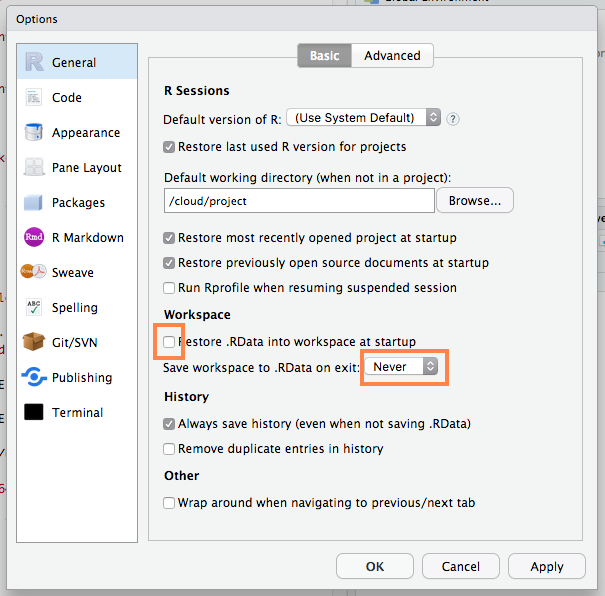

```{r setup, message=FALSE}
knitr::opts_chunk$set(echo = TRUE, results = "hide", eval = FALSE)
library(tidyverse)
set.seed(181871)
```

# Project Organization

A *project* now refers to a collection of files and folders for one task. 

It could refer to a homework, a consulting project, a data analysis project, or your class project.

Today we'll look at the following reccomendations in the order in which you encounter them in practice:

* 3a Create an overview of your project.
* 4a Put each project in it's own directory, which is named after the project.
* 4b Put text documents associated with the project in the `doc` directory.
* 4c Put raw data and metadata in a `data` directory and files generated during cleanup and analysis in a `results` directory.
* 4d Put project source code in the `src` directory.
* 4e Name all files to reflect their content or function.
* 5h Use a version control system.

From Wilson G, Bryan J, Cranston K, Kitzes J, Nederbragt L, et al. (2017) *Good enough practices in scientific computing.* PLOS Computational Biology 13(6): e1005510. https://doi.org/10.1371/journal.pcbi.1005510

Our coin toss simulation is just getting to the point where it is annoying to be all in one Rmd -- especially since the simulation takes a few seconds.

## 4a Put each project in it's own directory, which is named after the project.

>  Like deciding when a chunk of code should be made a function, the ultimate goal of dividing research into distinct projects is to help you and others best understand your work.

> As a rule of thumb, divide work into projects based on the overlap in data and code files. If 2 research efforts share no data or code, they will probably be easiest to manage independently. If they share more than half of their data and code, they are probably best managed together, while if you are building tools that are used in several projects, the common code should probably be in a project of its own.

> The important concept is that it is useful to organize the project by the types of files and that consistency helps you effectively find and use things later.

For us, this directory will also be an **RStudio Project** and also a **git repo**.

## 4a - With the coin toss simulation study

I've already created the project (so I can provide some starter code).

https://rstudio.cloud/spaces/4116/project/106514

RStudio Projects are a directory plus some minimal meta data contained in a .RProj file.

If you need to do this for another project:

* **In a local RStudio:** New Project -> New Directory  (Or `usethis::create_project()`)

* **Cloud:** From Workspace -> New project, Rename at top

Both create the directory and set it up as an RStudio project.

Our goal is that this directory contains everything needed for our analysis and is completely portable (this directory could be anywhere) and reproducible.

## 3a Create an overview of your project.

> Have a short file in the project's home directory that explains the purpose of the project. This file (generally called README, README.txt, or something similar) should contain the project’s title, a brief description, up-to-date contact information, and an example or 2 of how to run various cleaning or analysis tasks.

Also a great place to remind yourself of your motivation, or a to do list of things you need to work on, or links to important resources.

## Your Turn

```{r}
usethis::use_readme_rmd()
```

Edit the resulting file to include a short summary of this project. Knit it.

## 5h Use a version control system.

Now is a good time to set up version control...

Also read the sections: *What not to put under version control*, *Inadvertent Sharing*.

Set up git credentials on Termial
```
git config --global user.email "your email here"
git config --global user.name "your name here"
git config --global credential.helper 'cache --timeout 3600'
```

**Your Turn**

```{r}
usethis::use_git()
```

**This doesn't set up and link to a repo on github, you'll learn how to to do that in lab**

## 4d Put project source code in the `src` directory.

> `src` contains all of the code written for the project. This includes programs written in interpreted languages such as R or Python; those written in compiled languages like Fortran, C++, or Java; as well as shell scripts, snippets of SQL used to pull information from databases; and other code needed to regenerate the results.

For us, this will mostly be definitions of R functions, in which case put it in `R`, not `src`.  This follows the conventions for R packages and allows us to leverage the devtools package for easy loading and documentation.

Pick up here ... Tuesday. 

## Your Turn

```{r}
usethis::use_r("simulation.R")
```

Creates an R script in the `R/` directory.  Cut and paste the three functions from `sim.Rmd` into here.

```{r}
usethis::use_description()
```

Creates DESCRIPTION, a file that devtools uses to recognize this as an R package.

Then you can do:
```{r}
devtools::load_all() # OR Cmd/Crtl + Shift + L
```
to load all the functions in `R/` and any documentation you've written (we haven't written any yet).

## 4b Put text documents associated with the project in the `doc` directory.

>  This includes files for manuscripts, documentation for source code, and/or an electronic lab notebook recording your experiments. Subdirectories may be created for these different classes of files in large projects.

I've also seen suggestions for this to be called `analysis` or if you only have one file in here, it's OK to put it in the main project directory instead.

## 4c Put raw data and metadata in a `data` directory and files generated during cleanup and analysis in a `results` directory.

> where "generated files" includes intermediate results such as cleaned data sets or simulated data, as well as final results such as figures and tables. The `results` directory will usually require additional subdirectories for all but the simplest projects. Intermediate files such as cleaned data, statistical tables, and final publication-ready figures or tables should be separated clearly by file-naming conventions or placed into different subdirectories; those belonging to different papers or other publications should be grouped together.

## Your Turn

Replace the three functions in sims.Rmd with `devtools::load_all()`

Run the code in sims.Rmd.  If we were to save the resulting tibble,   `runs_big` of output where should we save it?

What format should we save it in?

CSV is good for portablility and is human readable.  Use to save cleaned data,  we could use it here if we restrict saving to the columns that aren't list columns.

RDS is good for complicated data structures, quick to load.  Good for svaing intermediate objects when you don't need to share with people that don't use R.

Save RDS with `readr::write_rds()`, e.g. to save in current directory:
```{r}
write_rds(runs_big, "sims.rds")
```

When you need it later, import with `readr::read_rds()` and assign it to a variable:
```{r}
runs_big <- read_rds("sims.rds")
```


Why not RDA? Can't give the object a name when you read it in, you have to remember what you called it when you saved it
```{r}
x <- runs_big
save(x, file = "y.rda")
rm(x)
load("y.rda") # where is it? It's in an object called x
```

## Keeping your project portable

Never hard code any file paths above the project directory.

E.g. This is **BAD**, because it will never work for anyone else, or if I move my project directory:
```{r, eval = FALSE}
setwd("/Users/wickhamc/Documents/Projects/cointoss/")
my_data <- read.csv("data/coin_data.csv")

# OR also bad
read.csv("/Users/wickhamc/Documents/Projects/cointoss/data/coin_data.csv")
```

Instead rely on RStudio projects (they set the working directory to the project directory) and the here package.

## Your Turn 

Run:
```{r}
library(here)
here("results", "sim-output.rds")
```

What happens?

**Save the simulation results into an appropriate location.**  Use `write_rds()`, you might need to create the appropriate directory too.

Read more at: https://www.tidyverse.org/articles/2017/12/workflow-vs-script/

> Any resident R script is written assuming that it will be run from a fresh R process with working directory set to the project directory. It creates everything it needs, in its own workspace or folder, and it touches nothing it did not create. For example, it does not install additional packages (another pet peeve of mine).

> This convention guarantees that the project can be moved around on your computer or onto other computers and will still "just work". I argue that this is the only practical convention that creates reliable, polite behavior across different computers or users and over time. This convention is neither new, nor unique to R.

> It's like agreeing that we will all drive on the left or the right. A hallmark of civilization is following conventions that constrain your behavior a little, in the name of public safety.

A fresh R process is only guaranteed with a few extra settings: uncheck Restore .RData, never save workspace on exit.



## Your Turn

1. Create a new Rmarkdown document. 

2. Load the tidyverse and here packages.

3. Load the simulation output.

4. Move the summary and plotting code to this new document.

5. Save it with an appropriate name, in an appropriate place.

## 4e Name all files to reflect their content or function.

> For example, use names such as `bird_count_table.csv`, `manuscript.md`, or `sightings_analysis.py`. Do not use sequential numbers (e.g., `result1.csv`, `result2.csv`) or a location in a final manuscript (e.g., `fig_3_a.png`), since those numbers will almost certainly change as the project evolves.

I sometimes use sequential prefixes in addition to a name to indicate an order of an analysis, e.g. `00_data-cleaning.Rmd`, `01_analysis.Rmd`, `02_reporting.Rmd`.

## Your Turn

Our Rmarkdown document to create the simulation output is in the wrong place with a bad name ... fix it.

## Adding dependencies

You can formally add pacakges your project relies on with `usethis::use_package()`.  This adds a line to the `DESCRIPTION` file
```{r, eval = FALSE}
usethis::use_package("tidyverse")
```


# Reading for Thursday

[Section 1.2 Introduction](https://oregonstate.instructure.com/courses/1689180/files/folder/Readings?preview=72513399) (page 8) up to and including page 10, in Bootstrap Methods: A Guide for Practitioners and Researchers by Michael R. Chernick 

Be prepared to answer the following questions:

* Usually when thinking about constructing an estimate for a paramater, we make some assumptions about the population distribution.  What does the bootstrap replace the population distribution with?  Why is this a good replacement?

* Why do we need a Monte Carlo approach?

If you've seen the bootstrap before, you might continue reading to the end on the Introduction, paying attention to the reasons the bootstrap might not work.
